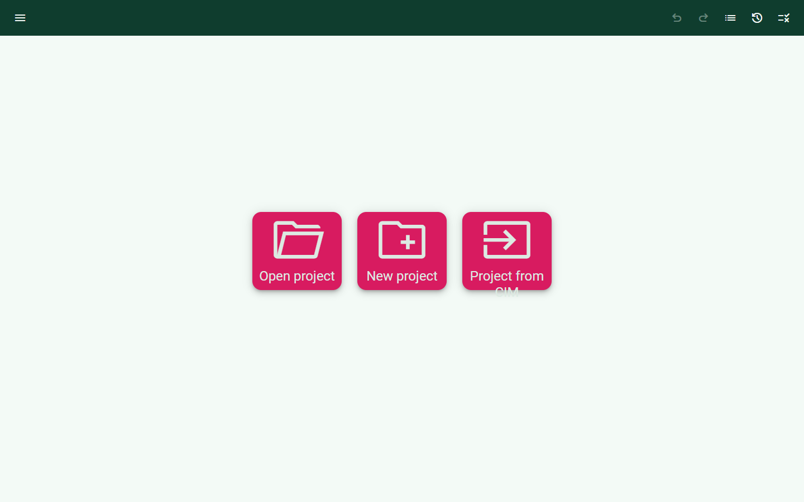
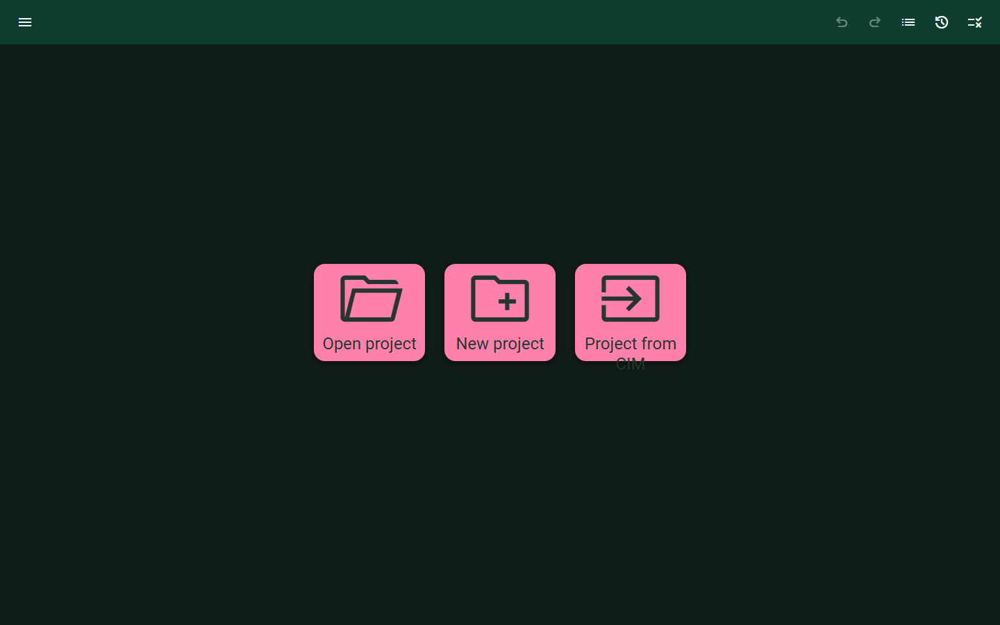
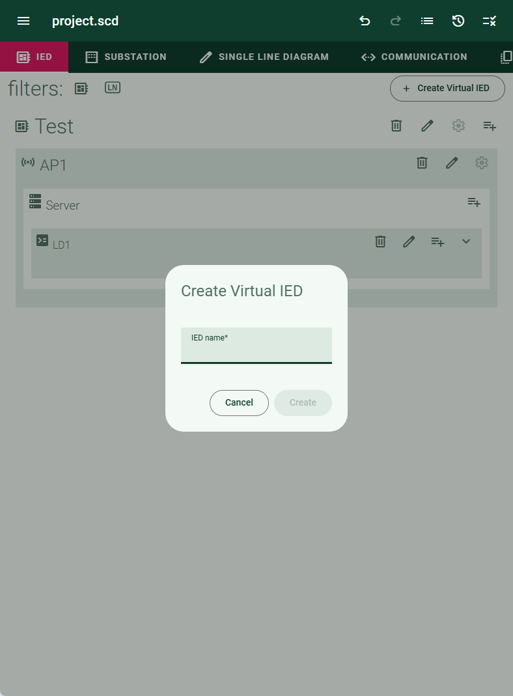

# demo-branding

Smallest possible CoMPAS OpenSCD distribution with a custom customer brand.

The image is [`lfenergy/compas-open-scd:v0.44.0.21`](https://hub.docker.com/r/lfenergy/compas-open-scd/tags) with one file added: `customer-branding.css`, copied to `/usr/share/nginx/html/css/customer-branding.css`. The base image already links that stylesheet.

Surfaces are a light green. Primary is dark green: the app bar, inactive editor tabs, and focused fields. Secondary is pink: the landing actions and the active editor tab. In dark mode the app bar stays dark green, the page turns deep green, and secondary shifts to a lighter pink so labels stay readable.

## Build

From this directory:

```sh
docker build -t demo-branding .
```

## Run

```sh
docker run --rm -p 8080:8080 --name demo-branding demo-branding
```

Open [http://localhost:8080](http://localhost:8080).

Stop the container with Ctrl+C. A detached container (`docker run -d`) stops with `docker stop demo-branding`.

Set the theme under **Settings → Theme**: System default, Light, or Dark. The landing screenshots below are Light and Dark. The IED screenshot is Light.

Without a CoMPAS backend, startup shows the snackbar "Error communicating with CoMPAS Ecosystem". Close it to reach the landing page.

## Expected results

### Light theme

Pale green page, dark green app bar, pink action tiles.



The third label, "Project from CIM", is cut off by the stock action button in the base image.

### Dark theme

Deep green page, dark green app bar, lighter pink action tiles.



### IED editor

Open a project and select **IED**. In this shot `project.scd` is open and **Create Virtual IED** is showing.


